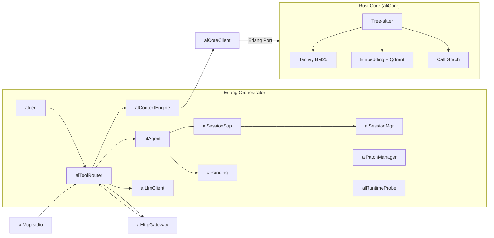

# ali 架构说明

## 总览

ali 是嵌入 Erlang 节点的 **运行时感知 AI 开发助手**，采用双层架构：



## 职责边界

| 层 | 职责 | 不负责 |
|----|------|--------|
| **Erlang** | OTP 生命周期、工具路由、LLM/Session、运行时探针、Patch 安全、节点内 API | 重型 AST 解析、向量索引 |
| **Rust Core** | Tree-sitter 符号提取、BM25/向量检索、call graph、索引持久化 | 直接操作 BEAM 进程 |

## 核心数据流

### 1. 问答 `ali:ask/2` / 流式 `ali:askStream/2`

1. `alServer` 解析 session，经 `alSessionSup` 确保 worker
2. `alContextEngine` 拉取代码搜索 + 模块符号 + 调用关系 + runtime 快照
3. `alToolRouter:toolLoop`：同步 `chatWithTools` 或流式 `streamChatWithTools`
4. 进度事件：`started` / `token` / `toolStarted` / `toolFinished` / `approvalRequired` / `completed`
5. 写操作经 `alPending` 原子审批；continuation + checkpoint 可恢复
6. 回答与 artifacts 写回 `alSessionMgr`（含 SQLite `session_artifacts`）

### 2. 索引 `ali:index/1`

1. Erlang 经 Port 调用 Rust `index`（默认异步后台）
2. 跨平台路径键规范化（`/` + 相对根）
3. 文件级 `file_hash` 增量；Tantivy `delete_term` 更新或双缓冲全量重建
4. `state.json` 仅存元数据（不含正文），降低三重存储
5. embedding 批处理；Qdrant 使用稳定 FNV point id

### 2.1 检索策略

- **Hybrid**：BM25 候选文件内向量重排（无 Qdrant 时避免全表扫描）
- **预检索**：`alContextEngine` 按意图同步 search
- **全文**：`searchText` → ripgrep / Erlang 兜底

### 2.2 长期记忆

- **SoT**：SQLite `memories` 表（`alMemory` / `alLocalDb`）
- **可重建缓存**：aliCore 向量索引（Qdrant collection 或本地 `embeddings.json` 的 `memory:*` 键）
- 写入：`remember` → SQLite INSERT → 异步 `memory_upsert`
- 召回：语义优先向量；无命中 / core 不可用 → SQL `LIKE` 关键词
- 运维：`ali:rebuildMemoryIndex()` 从 SQLite 全量重建向量；`ali:forget(Id)` 删行并尽力清缓存

### 3. Patch

- `validate` / `dryRun` / `apply` / `applyBatch` / `rollback`
- 支持 `replace{old,new}` 与 unified `diff`/`unified` 字段
- 写后可 `verifyCompile`；`runTestsForPatch` 对改动模块跑 eunit

### 4. 对外入口

| 入口 | 端口/方式 | 说明 |
|------|-----------|------|
| Web UI / REST / WS / SSE | **8787**（`web.port`） | Agent 工具循环 + 审批 |
| MCP stdio | `.cursor/mcp.json` / `priv/scripts/mcp.ps1` | tools/resources/prompts |
| Erlang API | `ali:*` | 同节点直接调用 |

工具名同时接受 camelCase 与 snake_case（如 `searchCode` / `search_code`）。

## 源码布局（`src/`）

| 目录 | 职责 |
|------|------|
| 根目录 | `ali` / `ali_app` / `ali_sup` OTP 入口 |
| `agent/` | 会话编排、策略、审批、补丁、上下文 |
| `core/` | `alCoreClient`、本地索引回退、文件监听、Qdrant 托管 |
| `memory/` / `skill/` | 长期记忆、技能模板 |
| `tools/` / `llm/` / `db/` / `mcp/` / `web/` / `misc/` | 工具、LLM、存储、MCP、网关、配置 |

模块名不随目录变化；rebar3 递归编译整个 `src/`。

## 配置

唯一主配置：`config/aliCfg.cfg`（经 `alConfig` → `alCfg`）。  
`config/sys.config` 仅为 rebar shell/release 占位。

```erlang
{web, #{enabled => true, port => 8787}},
{llm, #{apiKey => "${ENV:ALI_LLM_API_KEY}", ...}}
```

未展开的 `${ENV:...}` 在 `strictCfg=true` 时视为缺失。

## 验证

```bash
rebar3 compile && rebar3 eunit
rebar3 ct --suite=test/ali_SUITE
cargo test --manifest-path c_src/aliCore/Cargo.toml
# 无 LLM：
rebar3 shell → alVerify:run(alVerify:nonLlmCategories()).
```
