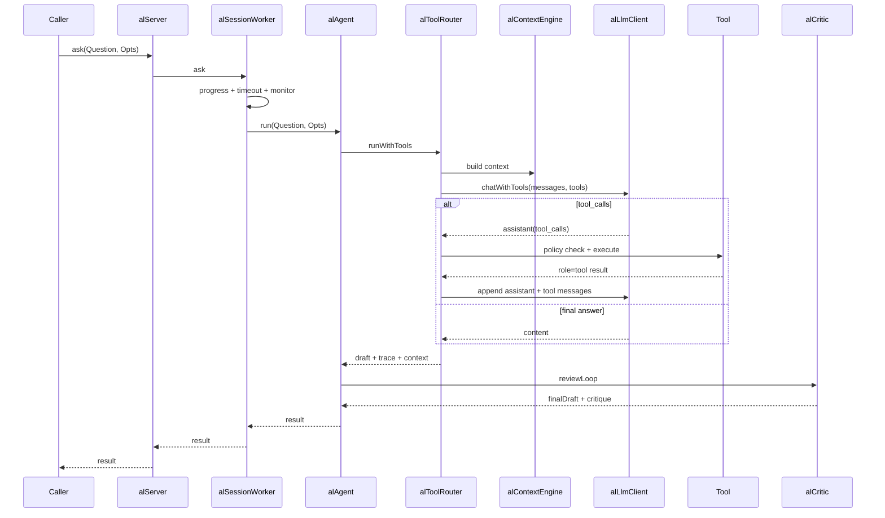

# ali 项目从零学习、调试与改造指南

> 适用版本：2026-07-20 当前源码  
> 目标读者：第一次接触本项目，具备基础 Erlang 语法但不一定熟悉 OTP、LLM Agent 或 Rust Port  
> 阅读目标：能独立启动、观察、追踪一次 ask、增加一个工具、定位一次故障，并能安全地规划架构改造

---

## 0. 怎么使用这份指南

不要从第一个文件一路读到最后一个文件。这个项目横跨 OTP、LLM 协议、工具编排、索引、存储和 Web；按目录阅读很容易失去主线。

推荐采用四轮学习法：

1. **先跑通**：知道系统怎么启动、怎样确认健康。
2. **追一条链**：只追踪一次 `ali:ask/2`，建立全局心智模型。
3. **分层实验**：分别操作工具、会话、Port、记忆和运行时探针。
4. **小步改造**：先改纯函数和边界测试，再改进程状态和协议。

建议每读完一节都在 shell 里执行对应实验。代码看懂不等于运行时行为看懂。

如果你说的“计数原理”本意是“技术原理”，本指南两者都覆盖；第 11 章还会专门讲 Token、指标、进度索引、reductions、内存和时间的计数方法。

---

## 1. 一句话认识 ali

ali 是一个嵌入 Erlang 节点的 AI 开发助手：

- Erlang/OTP 负责生命周期、会话、Agent 循环、工具、安全策略和外部接口；
- Rust `aliCore` 作为 Port 子进程，负责 Tree-sitter、Tantivy、调用图、SQLite 和可选向量能力；
- LLM 不直接操作系统，而是通过受控工具目录发起调用；
- 写文件、危险执行等操作必须经过策略检查和审批；
- Rust Core、Embedding、Rerank、Qdrant 不可用时，关键功能尽量降级而不是让整个应用退出。

最重要的心智模型是：

```text
用户请求
  → 会话 worker
  → Agent 编排
  → 上下文构建
  → LLM 决定回答或调用工具
  → 策略检查
  → 工具执行
  → 结果回填给 LLM
  → Critic 复审
  → 会话/记忆/审计持久化
  → 返回用户
```

---

## 2. 源码地图：每个目录负责什么

### 2.1 顶层入口

- `src/ali.erl`：面向使用者的公共 API。遇到“不知道功能从哪里进”时先看这里。
- `src/ali_app.erl`：OTP application 回调。
- `src/ali_sup.erl`：顶层监督树和子进程启动顺序。
- `src/ali.app.src`：application 元数据、依赖、注册进程和模块清单。

### 2.2 Agent 编排层：`src/agent/`

核心模块：

- `alServer`：对外 ask/stream/async 路由，管理会话 worker。
- `alSessionSup`：动态监督每个会话的 worker。
- `alSessionWorker`：单会话串行入口、问答任务监控、超时和取消。
- `alAgent`：工具循环之后的 Critic、记忆和会话 artifacts 编排。
- `alContext`：system prompt、技能注入、历史裁剪。
- `alContextEngine`：代码、符号、调用图和运行时上下文聚合。
- `alCritic`：回答复审与有限轮次修订。
- `alPolicy`：工具风险等级、模式矩阵、审批判断和敏感字段脱敏。
- `alPending`：待审批操作的原子 claim、TTL 和磁盘恢复。
- `alCheckpoint`：工具循环 continuation 的断点保存与恢复。
- `alPlan`：多步骤任务计划。
- `alProgress`：异步/流式进度事件。
- `alTask`：异步任务状态。
- `alPatchManager`：补丁校验、干跑、应用、验证和回滚。
- `alAudit`：审计记录和深度脱敏。

辅助模块：

- `alAttachments`：图片、文本附件和文档的规范化。
- `alBackup`：文件备份。
- `alMetrics`：ask/tool 计数与延迟分位数。
- `alRuntimeProbe`：进程、ETS、内存、reductions、监督树。
- `alTokenStats`：Token 用量和费用估算。
- `alSimulator`：模拟执行。
- `alSubAgent`：子代理编排。
- `alChat`：终端 REPL。
- `alVerify`：系统功能验证。

### 2.3 工具层：`src/tools/`

- `alToolCatalog`：工具规格和统一注册表。
- `alToolRouter`：LLM tool loop、策略执行、并行工具调用、结果封顶。
- `alToolsExt`：文件、BEAM、测试、计划、委派等扩展工具。
- `alToolCache`：白名单工具结果缓存。
- `alSearch`：ripgrep 优先、Erlang 回退的全文搜索。
- `alAppTopology`：应用拓扑观察。
- `alSpecIndex`：spec/type 反向检索。

### 2.4 LLM 协议层：`src/llm/`

- `alLlmClient`：OpenAI 兼容与 Anthropic 调用、重试、流式解析、tool calls。
- `alLlmTools`：工具名称、参数解码和 function-calling 结构。
- `alJson`：jiffy 边界封装、UTF-8 安全处理。

### 2.5 Core 基础设施：`src/core/`

- `alCoreClient`：Erlang Port 唯一持有者，请求 FIFO、超时、关闭和重连。
- `alCodeIndex`：Rust Core 不可用时的 Erlang 回退索引。
- `alFileWatcher`：轮询源码 mtime，触发重索引。
- `alQdrant`：可选 Qdrant 子进程托管。

### 2.6 存储与知识

- `src/db/`：DB 门面、JSONL 文件回退、归档和 Git 索引。
- `src/memory/alMemory.erl`：长期记忆；SQLite 是事实源，向量索引是可重建缓存。
- `src/skill/alSkill.erl`：内置/外部技能、触发词评分、prompt 注入。

### 2.7 外部接口

- `src/web/`：HTTP、WebSocket、SSE、鉴权、限流和静态 UI。
- `src/mcp/`：MCP Server/Client。
- `src/misc/`：配置加载、配置模块生成。

### 2.8 Rust 数据面

- `c_src/aliCore/`：Rust crate。
- 重点关注 `src/main.rs` 或 Port 入口、路由分发、索引、数据库、embedding、rerank 和 Qdrant 相关模块。
- Erlang 端只依赖稳定 JSON 协议，不应依赖 Rust 内部结构。

---

## 3. 从零启动：先建立一个可重复环境

### 3.1 前置环境

确认：

```powershell
erl
rebar3 version
cargo --version
```

Windows 建议通过 PowerShell：

```powershell
.\priv\scripts\start.ps1
```

也可以手工：

```powershell
rebar3 compile
rebar3 shell
```

`rebar3 compile` 的 pre-hook 会编译 Rust Core 并尝试复制到 `priv/`。若提示 `priv/aliCore.exe is in use`，通常是已有 shell 正持有该可执行文件；Erlang 源码仍可能编译成功，但新 Rust 二进制不会覆盖旧文件。

### 3.2 配置安全

主配置是 `config/aliCfg.cfg`。

必须遵守：

- 不要把真实 API Key 提交到 Git；
- 使用 `${ENV:ALI_LLM_API_KEY}` 等环境占位符；
- 已经暴露过的 Key 应立即在供应商后台轮换；
- `strictCfg=true` 适合 CI/生产，能让缺失配置在启动阶段暴露；
- 学习阶段可以暂时关闭 LLM，先验证工具和运行时路径。

### 3.3 启动后第一组命令

在 Erlang shell 中：

```erlang
application:which_applications().
whereis(ali_sup).
supervisor:which_children(ali_sup).
ali:health().
ali:coreStatus().
ali:serverStatus().
ali:supervisorTree().
```

预期不是“所有可选能力都启用”，而是：

- `ali_sup` 存在；
- 核心进程存活；
- Core 不可用时能看到明确状态；
- Web 端口冲突不应拖垮 Agent 主应用。

### 3.4 无 LLM 验证

```erlang
alVerify:run(alVerify:nonLlmCategories()).
```

或：

```powershell
.\priv\scripts\verify_non_llm.ps1
```

先把无外网路径跑通，再排查 LLM，能显著缩小问题范围。

---

## 4. OTP 启动与进程模型

### 4.1 顶层监督树

`ali_app:start/2` 启动 `ali_sup`。`ali_sup:init/1` 使用：

```erlang
#{strategy => one_for_one, intensity => 5, period => 10}
```

当前启动顺序：

1. `alQdrant`
2. `alLocalDb`
3. `alSessionMgr`
4. `alCoreClient`
5. `alCodeIndex`
6. `alFileWatcher`
7. `alSessionSup`
8. `alPending`
9. `alServer`
10. `alArchiver`
11. `alWebSup`

理解要点：

- `one_for_one` 表示一个子进程失败时只重启它，不自动重启其后所有兄弟；
- 启动顺序表达依赖，但不等于运行时重启依赖；
- Web 最后启动，因为它依赖会话与 Server；
- `alSessionSup` 是动态 supervisor，初始没有子进程。

监督树启动成功后，`ali_app:startApp/0` 还会执行三项应用级初始化：

1. `alCoreClient:ensureAvailable/0` 确认 Core 状态；
2. `alDbAdapter:ensureStarted/0` 初始化数据库适配层；
3. 根据 `core.indexBackground` 决定是否异步索引项目根目录。

因此“application 已启动”和“后台索引已完成”是两个不同状态，启动成功后立即搜索可能仍处在索引构建期。

### 4.2 每会话一个 worker

`alSessionSup:ensure_worker/2` 使用 `{session, SessionId}` 作为 child id，动态启动 `alSessionWorker`。

收益：

- 不同会话互相隔离；
- 同一会话可串行管理请求和状态；
- 可以精准取消某个会话任务；
- worker 异常不会直接破坏其他会话。

注意：当前 `alSessionWorker:doAsk/4` 发现同会话已有 ask 时，会取消旧 ask 并启动新 ask，而不是排队等待。改造并发语义前必须先决定产品需求是“最后一次请求获胜”还是“同会话 FIFO”。

### 4.3 monitor、link 和 timeout

Agent 执行使用 `spawn_monitor`：

- worker 进程异常时，session worker 收到 `'DOWN'`；
- session worker 本身不会被执行进程的异常连带杀死；
- 超时后主动 `exit(WorkerPid, kill)`；
- monitor 引用用于把 `'DOWN'` 对应回具体任务。

这比 `spawn_link + exit(Pid, kill)` 安全：`kill` 是不可捕获退出信号，链接关系会造成级联退出。

### 4.4 推荐实验

```erlang
{ok, Sid} = ali:createSession(learning).
ali:serverSessions().
alSessionSup:workers().
ali:askAsync(<<"解释 alSessionWorker">>, #{sessionId => Sid}).
alSessionSup:workers().
```

观察动态 worker 何时产生、任务如何关联到 session。

---

## 5. 一次 `ali:ask/2` 到底发生了什么

### 5.1 主调用链



### 5.2 `alAgent` 的职责

`alAgent:run/2` 不是底层 LLM 调用器，它负责高层编排：

1. 合并 Agent 配置和策略；
2. 确保 session；
3. 记录用户消息；
4. 必要时建立轻量 plan；
5. 调 `alToolRouter:runWithTools/2`；
6. 调 `alCritic:reviewLoop/4`；
7. 保存 summary、tool trace、critique；
8. 可选写长期记忆；
9. 保存 assistant 消息。

因此：

- 改工具协议应优先看 `alToolRouter`；
- 改最终回答复审看 `alCritic`；
- 改上下文看 `alContext` / `alContextEngine`；
- 改一次完整 Agent 生命周期才看 `alAgent`。

### 5.3 上下文构建

`alContextEngine:build/2` 聚合：

- 问题；
- 代码搜索命中；
- 相关模块；
- 符号文档；
- 调用边；
- 运行时快照；
- Core 可用状态。

搜索策略：

- Core 可用：优先 Rust 搜索；
- Core 失败：回退 `alCodeIndex`；
- 简单问候和过短输入可以跳过无意义检索；
- `includeRuntime=false` 可以关闭昂贵的运行时快照。

`alToolRouter` 还会做一次 prefetch cache：如果 LLM 随后用相同查询调用 `searchCode`，直接复用上下文阶段的搜索结果。

### 5.4 消息顺序

当前消息顺序：

```text
system
retrieved context（role=user）
历史消息（按时间）
当前 user 消息
```

历史中刚刚预先持久化的当前问题会被移除，避免重复。

LLM 消息是开放 JSON schema，使用 map 合适；内部固定状态可以使用 record。边界层不要为了“统一 record”引入大量脆弱转换。

---

## 6. Tool Loop 与 function calling 原理

### 6.1 协议轮次

一次工具轮次必须是：

```text
assistant {
  tool_calls: [
    {id: "call-1", function: {...}},
    {id: "call-2", function: {...}}
  ]
}
tool {tool_call_id: "call-1", content: "..."}
tool {tool_call_id: "call-2", content: "..."}
```

关键约束：

- 每条 `role=tool` 必须有 `tool_call_id`；
- id 必须对应前一条 assistant 的 tool call；
- 并行工具调用必须完整保留整轮；
- 不能按固定消息条数从中间裁断，否则供应商会拒绝 orphan tool message。

`trimToolMessages/1` 因此按完整协议轮裁剪，同时保留普通 user/assistant 历史。

### 6.2 循环终止条件

`toolLoop/6` 在以下情况终止：

- LLM 返回最终回答；
- `tool_calls` 缺失或为空，按最终回答处理；
- 达到 `maxToolSteps`；
- LLM 返回错误；
- 工具需要审批，保存 continuation 后挂起。

### 6.3 并行工具

多个 tool calls 使用独立 monitored process 并行执行：

- 单个工具崩溃转换为 `toolWorkerCrashed`；
- 超时工具被 kill；
- 主循环按原始调用顺序收集结果；
- 一个工具 worker 的错误不应杀死 ask worker。

### 6.4 结果大小控制

工具结果会经历多层控制：

- 可重试工具在结果过大时缩小 `limit` 再执行一次；
- `approxResultBytes/1` 递归识别 `content`、`entries`、`data`、`hits`、`result`；
- 发给 LLM 前编码成合法 JSON 文本；
- 超过硬上限时返回结构化 truncated marker，而不是从 JSON 中间截断；
- audit/cache 写入前也会封顶。

学习这个项目时必须记住：**“能编码”不等于“能安全进入协议”**。长度、UTF-8、角色、配对和可序列化类型都是边界约束。

### 6.5 新增一个工具的完整步骤

以新增 `projectStats` 为例：

1. 在 `alToolCatalog` 增加工具定义和 JSON schema；
2. 在 `alLlmTools` 确认名称映射与参数解码；
3. 在 `alPolicy:level/1` 明确风险等级；
4. 在 `alToolRouter:dispatchTool/3` 路由实现；
5. 如实现较大，放进 `alToolsExt` 或专用模块；
6. 规范返回 `{ok, Value}` / `{error, Reason}`；
7. 增加参数错误、策略拒绝、正常返回、超大返回测试；
8. 验证 `ali:callTool(projectStats, Args)`；
9. 再验证 LLM function calling 路径。

不要依赖未知工具的默认风险：未知工具会被视为 `executeRisky`，这是安全兜底，不是注册机制。

---

## 7. 安全策略、审批与恢复

### 7.1 四级风险

`alPolicy` 定义：

- `read`
- `executeSafe`
- `executeRisky`
- `write`

三种模式：

- `ask`：read + executeSafe；
- `edit`：再允许 write；
- `exec`：允许所有等级。

模式允许不代表立即执行，还必须满足 policy 的 allow 开关；write 和 executeRisky 还可能要求确认。

### 7.2 审批状态机（设计意图）

写工具需要确认时，设计意图是：

1. `alPending:put/5` 保存 pending 条目；
2. tool loop 构建 continuation；
3. continuation 附着到 pending，并保存 checkpoint；
4. 返回 `approvalRequired` / `suspended=true`；
5. 用户调用 `ali:approve(TaskId)`；
6. gen_server 内通过 `ets:take` 原子 claim；
7. 在 gen_server 外执行已批准工具；
8. 用工具结果恢复 tool loop；
9. 最终仍经过 Critic、记忆和会话持久化。

“claim 与执行分离”非常重要：如果在 `alPending` 的 `handle_call` 内同步恢复，而恢复过程再次调用 `alPending`，会造成 self-call 死锁。

### 7.3 当前已知缺口：pending 检测与结果形态不一致

这是学习与改造时必须优先验证的问题：

- `executeTool/3` 在 `confirmationRequired` 时返回 map：`#{status => pending, taskId => ...}`；
- `toolResultMessage/2` 经 `capToolResult/1` 后，把 `content` **编码成 JSON binary**；
- `findPendingTool/2` 却只匹配 `content := #{status := pending, ...}` 这种 **map** 形态。

结果是：pending 条目可能被创建，但 tool loop 很可能 `miss`，不会 attach continuation，也不会以 `suspended` 结束；后续 `approve` 若没有 continuation，只会单独执行工具，无法恢复原 tool loop。

现有单元测试覆盖了 Pending API 和裁剪逻辑，但缺少“写工具 → 挂起 → attach → approve → resume”端到端回归，所以这类形态漂移容易漏网。

### 7.4 持久化

- pending：`.ali/pending/<taskId>.json`
- checkpoint：`.ali/checkpoints/<taskId>.json`
- audit：`.ali/audit/*.jsonl`

重启恢复时 JSON key 和 role 可能是 binary；加载路径必须归一化为内部预期形态。成功完成后 checkpoint 不一定自动删除，列表可能残留旧任务。

### 7.5 实验

在 `edit` 模式发起一个写文件请求：

```erlang
ali:setMode(edit).
ali:ask(<<"在允许目录创建一个临时测试文件">>).
ali:pendingList().
%% 观察返回是否 suspended=true，以及 pending Entry 是否含 continuation
ali:approve(TaskId).
```

只在测试分支和临时文件上实验。重点断言：

- pending 是否出现；
- 返回是否真的 `suspended=true`（而不是把 pending JSON 当普通工具结果继续喂 LLM）；
- Entry 是否含 `continuation`；
- approve 后是否恢复原 tool loop，而不是只单独跑一次工具；
- audit 是否有对应记录。
---

## 8. Rust Core 与 Erlang Port

### 8.1 为什么使用 Port

Port 让 BEAM 管理外部 OS 进程，同时通过消息式 API 交换数据：

- Rust 崩溃不会直接破坏 BEAM 内存；
- Erlang 仍控制启动、关闭、超时和重连；
- Rust 可以使用 Tree-sitter、Tantivy、SQLite 等生态；
- 边界协议必须显式、可测试。

### 8.2 framing：`{packet,4}`

`open_port` 使用 4 字节长度前缀：

```text
[4-byte big-endian length][JSON payload]
```

它解决“stdin/stdout 是字节流，不知道一条消息在哪里结束”的问题。Rust 端和 Erlang 端必须使用相同 framing。

请求 JSON 形态：

```json
{
  "method": "post",
  "path": "/search",
  "body": {"query": "gen_server", "limit": 5}
}
```

响应成功形态：

```json
{"ok": true, "data": {...}}
```

Erlang 归一为：

```erlang
{ok, #{engine => rustCore, data => Data}}
```

### 8.3 单 inflight + FIFO

`alCoreClient` 同一时刻只允许一个 inflight：

- 无 inflight：立即 `port_command`；
- 已有 inflight：放入 `queue`；
- 收到响应：回复调用方，派发下一项。

优点是协议简单，不需要 request id。代价是索引等重请求可能阻塞后续查询。

### 8.4 为什么超时要关闭 Port

如果请求 A 已超时，但 Rust 后来才返回 A 的响应，而 Erlang 已把 B 设为 inflight，那么没有 request id 的协议可能把 A 响应错配给 B。

当前策略：

1. A 超时；
2. 回复 A timeout；
3. 关闭 Port；
4. 排空队列并回复 portClosed；
5. 延迟重连。

这是用“牺牲排队请求”换“绝不响应错配”。

若未来要支持多路并发，必须同时引入：

- request id；
- Rust 端并发安全；
- 响应按 id 路由；
- 独立超时；
- backpressure 和最大队列；
- 重型 index 与轻型 query 的调度策略。

不能只把一个 Port 改成多个 worker 就宣称完成连接池。

### 8.5 推荐实验

```erlang
ali:coreHealth().
ali:coreStatus().
ali:index("src").
ali:search("alSessionWorker", 5).
ali:getSymbol(alSessionWorker, handle_info, 2).
ali:getCallers(alAgent, run, 2).
```

然后停止 Rust Core，重复搜索，观察 Erlang fallback。

---

## 9. 数据、会话与长期记忆

### 9.1 DB 门面

`alLocalDb`：

- Core 可用时优先使用 Rust SQLite；
- Core 查询失败时回退 `alFileDb`；
- 会话相关 SQL 固定走文件后端，避免被单 Port 的重型索引阻塞；
- `isSessionSql/1` 通过表名边界识别 `sessions` / `session_messages`。

文件后端是降级方案，不具备完整数据库的事务、索引和复杂 SQL 能力。

### 9.2 会话与记忆不是同一概念

会话：

- 保存对话消息、summary、tool trace、critique、token usage；
- 目标是恢复一次对话和展示 artifacts。

长期记忆：

- 保存可跨对话召回的事实、偏好、Agent turn；
- SQLite `memories` 是事实源；
- 向量索引只是可重建缓存；
- 语义检索无命中或 Core 不可用时回退 SQL LIKE。

不要把“清空会话”默认解释为“删除长期记忆”。

### 9.3 记忆写入路径

```text
remember
  → INSERT memories
  → SQLite 成功
  → 异步 memoryUpsert 到向量索引
```

向量更新失败不回滚 SQLite，因为事实源已经写入；可以通过 `rebuildMemoryIndex/0` 重建缓存。

### 9.4 Skill 原理

Skill 是 workflow prompt 模板：

- 内置 skill + `priv/skills/*.md`；
- 根据 trigger 关键词打分；
- 取前 `maxActiveSkills`；
- 把 `promptExtra` 注入 system prompt；
- 通过 `persistent_term` 缓存；
- 文件改变后需 `alSkill:cacheClear/0`。

`persistent_term` 适合读多写极少的数据，更新会造成全局代价，不适合频繁动态状态。

---

## 10. 外部接口如何映射到同一核心

### 10.1 Erlang API

先从 `src/ali.erl` 学：

- 问答：`ask`、`askStream`、`askAsync`
- 会话：`createSession`、`getSession`、`sessionMessages`
- 任务：`taskStatus`、`cancelTask`
- 审批：`approve`、`dismiss`、`pendingList`
- 检索：`index`、`search`、symbol/call graph
- 运行时：`runtime`、`processes`、`etsTables`、`supervisorTree`
- 工具：`tools`、`toolSpec`、`callTool`
- Patch：validate/dryRun/apply/rollback
- 记忆：remember/recall/forget/rebuild
- 运维：metrics/audit/health/status

### 10.2 Web

默认 8787，Web UI 与 Gateway 共用监听：

- REST/工具调用；
- WebSocket；
- SSE/流式事件；
- 静态 UI；
- API token、CORS、rate limit；
- 默认不允许远程写。

Web 层不应复制 Agent 逻辑，只负责认证、参数规范化、调用公共服务和结果编码。

### 10.3 MCP

MCP 让 Cursor 等客户端发现：

- tools；
- resources；
- prompts。

增加工具后要检查 MCP catalog 是否自动暴露或需要适配，不要只验证 Erlang API。

### 10.4 REPL

`alChat` 是最适合人工观察 Agent 的入口：

```erlang
ali:chat().
```

它会显示 progress，适合观察 tool call、审批和错误；但生产接口行为仍应通过 API/测试验证。

---

## 11. 项目中的计数原理

这一章区分“累计量、窗口样本、估算值、瞬时值”。混淆它们会产生错误结论。

### 11.1 Token 估算

`alTokenStats:estimate/1` 使用启发式：

```text
estimated_tokens = round(ASCII字符数 / 4 + 宽字符数 / 1.5)
```

例子：

- 400 个 ASCII 字符约 100 token；
- 150 个中文字符约 100 token；
- 混合文本分别计数后相加。

这不是 tokenizer，只适合容量和费用粗估。供应商返回 `usage` 时优先 `trackUsage/2`：

- OpenAI：`prompt_tokens` / `completion_tokens`
- Anthropic 风格：`input_tokens` / `output_tokens`

### 11.2 Token 原子累加

ETS 行结构：

```erlang
{Model, InputTokens, OutputTokens, ApiCalls}
```

使用：

```erlang
ets:update_counter(Table, Model, [{2, In}, {3, Out}, {4, Calls}])
```

这是原子计数，避免两个进程同时 read-modify-write 造成更新丢失。

费用公式：

```text
cost_usd =
  input_tokens  × input_price_per_1m  / 1,000,000
  + output_tokens × output_price_per_1m / 1,000,000
```

注意：

- 单价表会过期，应按供应商价格更新；
- 未知模型价格默认为 0，不代表真实免费；
- ETS 数据不跨节点重启持久化。

实验：

```erlang
alTokenStats:reset().
alTokenStats:estimate(<<"hello world">>).
alTokenStats:estimate(<<"你好，世界">>).
alTokenStats:trackUsage(<<"demo">>, #{prompt_tokens => 100, completion_tokens => 20}).
alTokenStats:stats().
```

### 11.3 Metrics 计数

全局累计量：

- `askCount`
- `okCount`
- `errorCount`
- `totalDurationMs`
- `totalToolCalls`

工具维度累计：

- calls
- okCount
- errorCount
- totalDurationMs

平均 ask 延迟：

```text
avgDurationMs = totalDurationMs div askCount
```

这是整数除法，且只表示自 reset/节点启动以来的全局平均值，不能反映尾延迟。

### 11.4 p50 / p95 / p99

`alMetrics` 每类最多保留最近 512 个延迟样本。计算时：

1. 排序；
2. `index = ceil(N × percentile / 100)`；
3. 取对应位置。

这是 nearest-rank percentile。

解释：

- p50：一半请求不超过该值；
- p95：95% 请求不超过该值；
- p99：适合观察少量极慢请求。

当前样本列表更新是 read-modify-write，高并发下理论上可能丢样本；计数器是原子的，延迟样本不是严格无损。若要用于生产 SLO，应考虑 histogram、HDR Histogram 或独立指标系统。

### 11.5 Progress 的 `nextIndex` 与 `eventCount`

每个 progress event 有单调 index：

```text
started.index = 0
nextIndex = 1
```

每 emit 一次：

- event.index = nextIndex；
- nextIndex + 1；
- 新事件存到反向列表头部；
- snapshot 时 reverse 恢复时间顺序；
- 最多保留 500 条。

`snapshot(RunId, Since)` 用于增量轮询。

当前实现存在明确缺陷：

- `nextIndex` 表示历史上分配过的下一个序号；
- `eventCount` 在达到 500 后固定为窗口长度；
- WS / SSE / REPL 都把 `eventCount` 当增量游标；
- 因此第 501 条之后客户端会永久拿到空事件，无法继续收到进度。

改造方向：快照返回绝对 `nextIndex`/`oldestIndex`，按事件自身 `index >= Since` 过滤，并返回 gap/truncated 标志；不要把窗口长度当游标。

### 11.6 reductions

`reductions` 是 BEAM 对“执行工作量”的近似计数，不是 CPU 毫秒。

特点：

- 函数调用、调度等消耗 reductions；
- 调度器用 reductions 保证进程抢占公平；
- 单次 snapshot 的绝对值意义有限；
- 应采两次做差：

```text
reduction_rate = (R2 - R1) / elapsed_seconds
```

进程级 reductions 高可能代表计算密集、消息风暴或忙循环，但必须结合：

- message queue length；
- memory；
- current function；
- wall-clock interval；
- scheduler utilization。

### 11.7 run queue

`runQueue` 是等待调度的 runnable 工作量快照：

- 接近 0 通常表示空闲；
- 持续显著高于在线 scheduler 数量可能说明 CPU 压力；
- 单次尖峰不能直接判定故障。

### 11.8 mailbox 长度

`message_queue_len` 是某进程尚未处理的消息数：

- 持续增长比瞬时值更重要；
- 消息大小不同，数量相同不代表内存相同；
- 大 mailbox 可能导致 selective receive 扫描成本上升；
- 应结合 reductions 和 memory 判断消费者是否跟不上。

实验：

```erlang
alRuntimeProbe:processes(#{
    sortBy => messageQueueLen,
    minMessageQueueLen => 1,
    limit => 20
}).
```

### 11.9 内存计数

`erlang:memory/0` 返回字节数分类：

- total
- processes / processes_used
- system
- atom
- binary
- code
- ets

进程 memory 包括 heap、stack、mailbox 等相关内存，但共享 binary 可能主要计入 binary 分类。看到大 binary 内存时应排查：

- 是否有进程持有小切片导致大 binary 无法回收；
- 工具结果/附件是否封顶；
- ETS 是否保存大二进制；
- 消息队列是否积压大 payload。

### 11.10 时间

项目同时使用：

- `system_time`：适合持久化时间戳、展示时间；
- `monotonic_time`：适合计算耗时；
- `unique_integer([positive, monotonic])`：适合当前 VM 内生成递增标识。

不要用两次 `system_time` 相减测延迟，因为系统时钟可能校准跳变。

### 11.11 Correlation ID

`alMetrics:correlationId/0` 把唯一整数转成 binary，存进进程字典：

- 同一进程后续读取相同 id；
- 不会自动跨进程传播；
- spawn 新进程时需要显式传递；
- 它是关联标识，不是安全 token，也不保证跨节点全局唯一。

---

## 12. Erlang/OTP 原理补课

### 12.1 Process

BEAM process 是轻量隔离单元：

- 独立 mailbox；
- 不共享可变堆；
- 通过消息通信；
- crash 是正常控制流的一部分，但边界必须监督和转换错误。

### 12.2 gen_server

适合：

- 需要串行化共享状态；
- 需要注册名；
- 需要同步 call / 异步 cast；
- 需要统一处理系统消息。

不适合把长时间任务直接放在 `handle_call` 内。项目中 Agent 执行和审批恢复都尽量移出关键 gen_server。

### 12.3 Supervisor

Supervisor 管生命周期，不解决业务一致性。

修改策略前问：

- 子进程之间是否真的存在状态依赖？
- 重启 A 是否必须重启 B？
- 重启范围扩大是否造成请求中断？
- intensity 是否会进入重启风暴？

### 12.4 ETS

ETS 是节点内共享内存表：

- public/protected/private 控制访问；
- set/ordered_set/bag 决定键语义；
- `update_counter` 适合原子计数；
- 数据随 owner 进程退出而消失，除非有 heir；
- 数据不跨节点重启。

项目里很多 `ensureStarted` 由首次调用者创建 ETS。改造时要注意 owner 生命周期，不要只看表名存在。

### 12.5 Map 与 record

建议：

- JSON/LLM/Port/工具参数：map；
- 字段开放、可选、跨版本：map；
- 内部固定 gen_server state：record；
- 需要编译期字段拼写检查：record。

不要为了风格把所有 map 改成 record。边界数据需要开放 schema，内部状态才需要收紧。

### 12.6 binary 与 charlist

项目频繁跨 JSON、文件路径和 Erlang API：

- JSON 文本优先 binary；
- `filename` API 常接受 list；
- Unicode charlist 可能包含大于 255 的 code point；
- `iolist_to_binary` 只接受 byte iolist，不能替代 Unicode 编码；
- Unicode 文本用 `unicode:characters_to_binary/1`。

这类类型边界是实际运行时崩溃的高发区，测试必须覆盖中文路径。

---

## 13. 测试体系与正确使用方式

### 13.1 编译

```powershell
rebar3 compile
```

注意 pre-hook 会构建 Rust。只想快速验证 Erlang 时仍可能触发 Cargo。

### 13.2 EUnit

全量：

```powershell
rebar3 eunit
```

单模块：

```powershell
rebar3 eunit --module=alToolRouter_tests
```

适合：

- 纯函数；
- 参数规范化；
- 协议边界；
- 状态转换；
- 回归已知崩溃输入。

### 13.3 Common Test

```powershell
rebar3 ct --suite=test/ali_SUITE
```

适合跨模块主流程和 OTP 生命周期。

### 13.4 Rust

```powershell
cargo test --manifest-path c_src/aliCore/Cargo.toml
cargo bench --bench core_micro --manifest-path c_src/aliCore/Cargo.toml
```

### 13.5 Dialyzer

```powershell
rebar3 dialyzer
```

它擅长发现“不可能匹配”和返回类型冲突，但动态 map、JSON 和大量开放 term 会削弱效果。关键内部结构应补 `-type`、`-spec`，必要时用 record。

### 13.6 测试分层原则

每个修复至少问四件事：

1. happy path 是否正确；
2. 类型变化是否安全（atom/binary/list/map/undefined）；
3. 外部返回畸形时是否降级；
4. 多轮、重启、并发和超时是否仍正确。

“单测绿但实跑炸”通常不是纯函数错，而是边界形态和生命周期没覆盖。

---

## 14. 调试手册

### 14.1 先判断在哪一层

按顺序：

1. 应用是否启动：`whereis(ali_sup)`；
2. 会话/Server 是否健康；
3. Core 是否可用；
4. LLM 是否配置；
5. 工具是否被策略拒绝；
6. 是否进入 pending；
7. 是否是协议消息损坏；
8. 是否是结果过大或类型异常。

### 14.2 看监督树

```erlang
ali:supervisorTree().
supervisor:which_children(ali_sup).
alSessionSup:workers().
```

### 14.3 看任务

```erlang
ali:tasks().
ali:taskStatus(TaskId).
ali:pendingList().
ali:listCheckpoints().
```

### 14.4 看审计和指标

```erlang
ali:auditLog(20).
ali:metrics().
alTokenStats:stats().
```

审计失败不应杀主流程；但审计中持续出现 truncated、toolTimeout、pathNotAllowed 代表真实系统问题。

### 14.5 热加载

编译后，已有 shell 仍可能加载旧 beam：

```erlang
l(alToolRouter).
```

目录迁移不改变模块名。大范围修改或 record 结构变化时优先重启节点，不要依赖逐模块热加载。

### 14.6 常见故障

`case_clause, Map`：

- 某处只匹配元组/列表，但实际得到 map；
- 查完整 stack；
- 不要只根据错误值猜模块；
- 为真实外部结构增加回归测试。

`pathNotAllowed`：

- 检查 projectRoot；
- 检查 `.` / `..` 折叠；
- 按路径分量比较，不能裸字符串前缀。

orphan tool：

- 检查 assistant(tool_calls) 与 tool result 是否完整配对；
- 检查裁剪是否从轮次中间切开；
- 检查重载后的 role 和 tool_call_id。

Port timeout：

- 预期 Port 被关闭并重连；
- 排队请求会收到 portClosed；
- 不要把 timeout 后迟到响应交给下一请求。

---

## 15. 练习路线：从读懂到能改

### 练习 1：只读公共 API

目标：知道系统提供什么。

阅读：

1. `src/ali.erl` export；
2. 每个 API 只追到下一层，不深入；
3. 在 shell 调 health、runtime、tools、search。

成果：画出“API → 服务模块”映射。

### 练习 2：追踪一次 ask

阅读顺序：

1. `ali:ask/2`
2. `alServer`
3. `alSessionWorker:doAsk1`
4. `alAgent:run`
5. `alToolRouter:runWithToolsSession`
6. `toolLoop`
7. `alCritic:reviewLoop`

成果：能解释每层为什么存在。

### 练习 3：新增只读工具

实现 `projectStats`：

- 返回 Erlang 文件数量；
- 风险等级 read；
- 限制扫描根目录；
- 返回结构化 map；
- 写 EUnit；
- 用 `ali:callTool` 验证；
- 用 LLM 验证。

### 练习 4：观察进程

```erlang
Before = alRuntimeProbe:snapshot().
%% 执行一批 ask/search
After = alRuntimeProbe:snapshot().
```

计算 reductions 差值，观察 process count、run queue、top processes。

### 练习 5：关闭 Core 验证降级

目标：

- 搜索仍可使用 Erlang 索引；
- DB/记忆理解哪些可回退；
- core status 明确；
- Agent 不因 Core 失败整体退出。

### 练习 6：审批恢复

用测试文件验证 pending → approve → resume → final answer。

### 练习 7：改造 Progress 游标

这是一个合适的中级任务：

- 明确 `firstIndex/nextIndex/storedCount`；
- snapshot 按事件 index 过滤；
- 覆盖超过 500 条后的增量读取；
- 保持 Web 客户端兼容。

---

## 16. 改造项目时的安全顺序

### 16.1 第一阶段：补边界类型

优先：

- binary/list/atom 归一化；
- JSON atom/binary key；
- Unicode；
- undefined/null；
- 外部返回 map/list 变化；
- tool 协议轮次。

### 16.2 第二阶段：固定内部结构

适合逐步引入：

- record 用于 gen_server state；
- 明确 `-type`；
- 为 continuation、tool result、session artifact 建类型；
- 不要强行把所有 JSON map record 化。

### 16.3 第三阶段：生命周期

检查：

- 谁 owner ETS；
- 谁监督 spawn 的进程；
- timeout 后谁清理；
- monitor 是否 demonitor；
- pending/checkpoint 是否在重启后恢复；
- Port 迟到响应是否可能错配。

### 16.4 第四阶段：性能

必须先测量：

- Core queue 等待时间；
- ask p95/p99；
- 工具结果大小；
- mailbox 趋势；
- reductions rate；
- ETS/binary 内存。

没有压力证据时，不要直接做 Port 连接池、全局缓存或大规模并行化。

### 16.5 第五阶段：架构演进

可能方向：

- Core 协议增加 request id；
- DB 与索引分 Port；
- `alProgress` 由受监督进程拥有 ETS 和定时清理；
- metrics 改为真正 histogram；
- 内部固定 map 收敛成 record/typed map；
- 会话并发语义从“新请求取消旧请求”改成显式策略；
- 文件后端明确能力边界。

每次只改变一个架构轴，并保留可回滚路径。

---

## 17. 推荐的 7 天学习计划

### 第 1 天：跑通和观察

- compile/eunit/CT；
- 启动 shell；
- health/coreStatus/supervisorTree；
- 阅读 `ali.erl`、`ali_sup.erl`。

### 第 2 天：OTP 与会话

- 阅读 `alServer`、`alSessionSup`、`alSessionWorker`；
- 创建两个 session；
- 发起异步 ask；
- 观察 worker、任务、取消。

### 第 3 天：Agent 与工具协议

- 阅读 `alAgent`、`alToolRouter`；
- 手工构造 assistant/tool messages；
- 理解 tool_call_id；
- 新增一个只读工具。

### 第 4 天：上下文与 LLM

- 阅读 `alContext`、`alContextEngine`、`alLlmClient`；
- 对比 tools=false 和 tools=true；
- 关闭 runtime context；
- 测试模型错误和 fallback。

### 第 5 天：Core、索引和存储

- 阅读 `alCoreClient`；
- 查看 Rust Port 路由；
- index/search/symbol/call graph；
- 关闭 Core 观察 fallback；
- 操作 memory。

### 第 6 天：安全和恢复

- 阅读 `alPolicy`、`alPending`、`alCheckpoint`、`alPatchManager`；
- 完成一次审批实验；
- 检查 audit；
- 模拟重启恢复。

### 第 7 天：计数、性能和改造提案

- 分析 metrics/token/progress/runtime；
- 采两次 snapshot 算 delta；
- 找一个真实瓶颈；
- 写一页改造 RFC：目标、证据、兼容、测试、回滚。

---

## 18. 读代码时持续问的十个问题

1. 这个模块属于边界层还是内部状态层？
2. 输入真实形态有哪些：atom、binary、list、map、null、undefined？
3. 这个调用会阻塞哪个 gen_server？
4. 子进程是 link 还是 monitor，谁负责清理？
5. timeout 后迟到消息会去哪里？
6. ETS 的 owner 是谁，owner 死亡后数据怎样？
7. 这是事实源还是可重建缓存？
8. 计数是累计值、窗口值、瞬时值还是估算值？
9. 外部依赖失败时是降级、重试、挂起还是崩溃？
10. 这个改动如何用无网络测试覆盖？

---

## 19. 当前值得关注的改造候选

按优先级排列；前几项已有源码证据，适合作为改造切入点：

### P0 / 行为正确性

1. **审批挂起检测**：`findPendingTool` 与 `capToolResult` 的 map/binary 形态不一致，可能导致 continuation 永不 attach。
2. **`alProgress` 500 事件后游标失效**：WS/SSE/REPL 增量进度会停更。
3. **`alSessionMgr:trimMessages/1`**：当前 `lists:split(2000, Messages)` 保留最旧 2000 条，与“丢弃最旧”意图相反。

### P1 / 生命周期与可观测性

4. `alProgress` / `alMetrics` / `alTokenStats` / `alPlan` 等 ETS 由偶然 owner 创建；`alServer` 重启或短生命周期进程退出会使表消失。
5. `alMetrics` 延迟样本是 read-modify-write，并发可能丢样本。
6. 同会话新 ask 会取消旧 ask；注释仍可能写 `sessionBusy`，以源码为准。
7. `askAsync`/`cancelTask` 与 session `taskRefIndex` 的关联可能不完整，不能假设强取消。
8. 流式路径可能出现两轮 `eStreamDone`（单轮 LLM 完成 + Agent 完成），接收端要明确处理语义。
9. `alMcpClient` 不在 `ali_sup` 下，崩溃后不会由 OTP 自动重启。

### P1 / 数据面

10. SQLite 与 JSONL fallback 可能形成持久域分裂，恢复后无自动回灌。
11. 托管 Qdrant 的 HTTP/gRPC 端口配置需核对，避免连错协议端口。
12. Core 索引 `state.json` 清空正文会导致重启后 snippet/embedding 退化。
13. `alCoreClient` 单 inflight FIFO：无界队列 + 队头阻塞；超时关 Port 是正确的，但需要队列指标和 backpressure。

### P2 / 质量债

14. `alTokenStats` 定价表外部配置化，并标注更新时间。
15. Core 多路复用：先引入 request id，再谈连接池。
16. 内部状态类型：优先 gen_server state 和 continuation；边界 JSON 保持 map。
17. README / 文档中的旧 API 命名（如 `call_tool`）持续校对为实际驼峰导出。
18. `config/aliCfg.cfg` 禁止明文 API Key；用 `${ENV:ALI_LLM_API_KEY}` 并轮换已暴露密钥。
---

## 20. 最后：怎样判断自己已经掌握项目

当你能不看文档回答以下问题，就已经具备独立改造能力：

- 为什么一次 ask 要经过 Server、SessionWorker、Agent、ToolRouter 四层？
- 为什么 tool message 不能独立裁剪？
- 为什么 Port 请求超时后必须关闭无 request-id 的连接？
- 为什么长期记忆以 SQLite 为事实源，而向量索引只是缓存？
- 为什么审批 claim 必须和执行分离？
- 为什么 reductions 不能直接当 CPU 时间？
- 为什么 Token 估算不能用于精确计费？
- 为什么 JSON 边界使用 map，而固定 gen_server state 更适合 record？
- 如何新增工具并确保策略、协议、MCP 和测试都完整？
- 如何设计一个改造，使其有观测指标、回归测试和回滚路径？

建议把自己的实验记录继续追加到独立学习笔记，不要直接修改本指南中的事实描述；架构变化时再统一更新指南。
